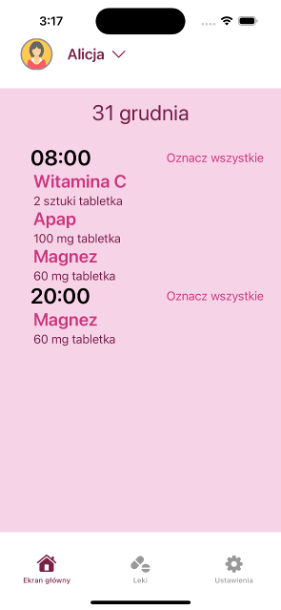
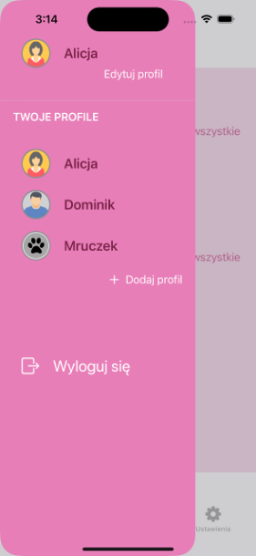
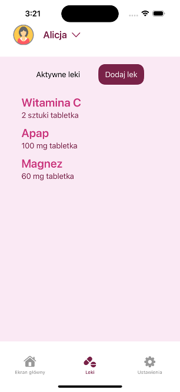
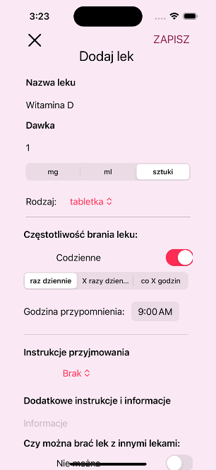

# MediTracker

**MediTracker** is a personal health management app built with SwiftUI and Firebase. It helps users track medications for multiple family members, automates daily medication schedules, and sends push notification reminders to ensure consistent treatment adherence.

## Features

- **Multi-user profile management** for coordinated family healthcare
- **Daily medication scheduling** with customizable reminder times
- **Push notification reminders** for timely medication alerts
- **Treatment history tracking** to monitor adherence and progress
- **Secure cloud storage** with real-time synchronization

## Technologies

- **Swift, SwiftUI**
- **Firebase** (Firestore, Authentication)
- **UserNotifications framework**
- **MVVM architecture pattern**

## Screenshots

  
  
   
  

